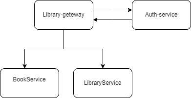

# Web API
Tools: Spring Cloud, Spring Boot, Spring Data, PostgreSQL, Spring Security, Docker

## Getting Started
1. Start ServiceRegistry. ServiceRegistry runs the Eureka server and database container.
2. Start AuthService, BookService, LibraryService.
3. Start LibraryGateway
